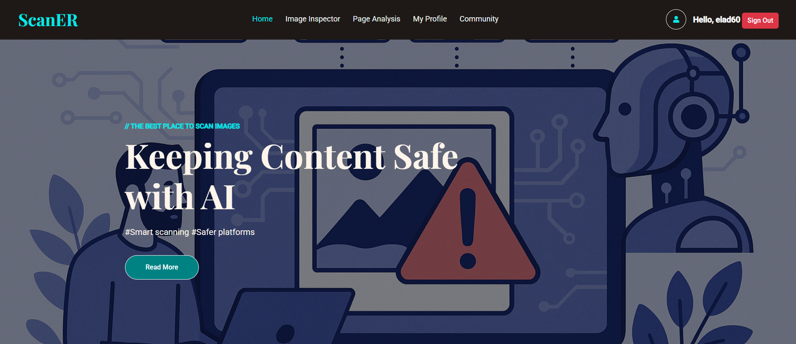
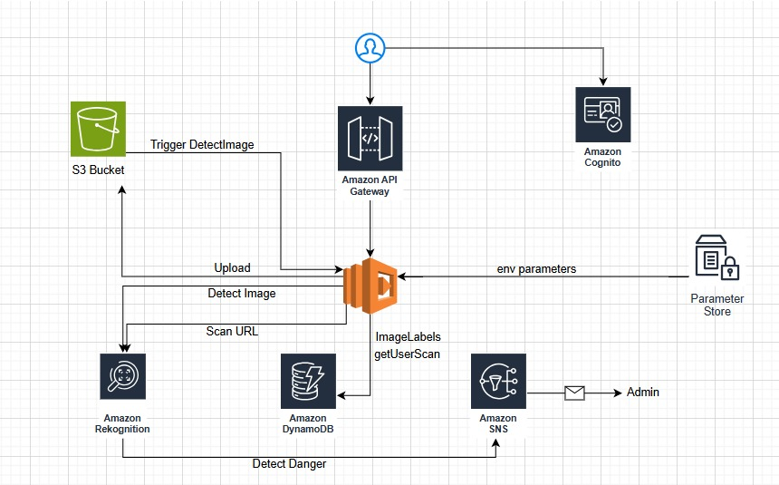
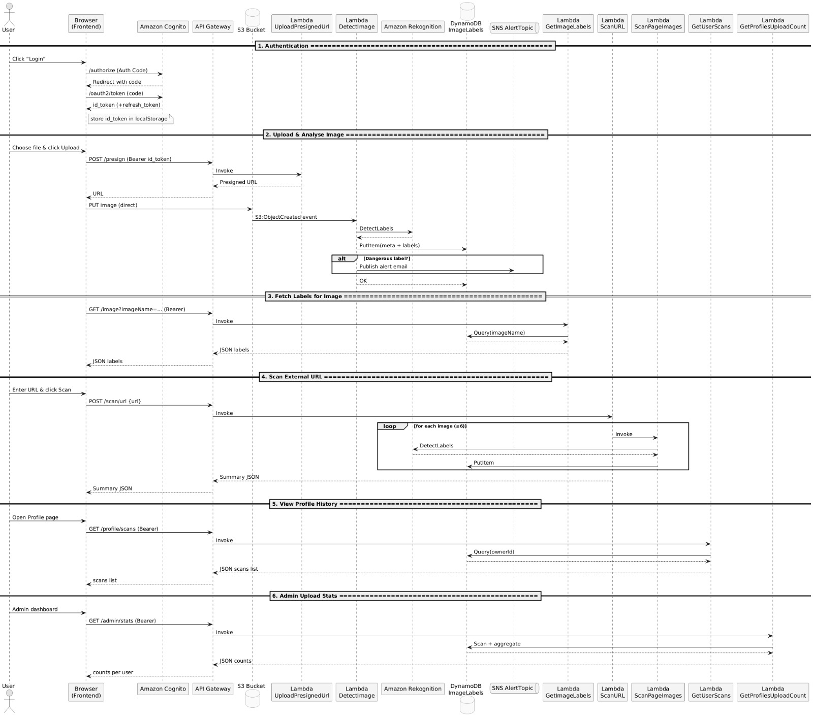
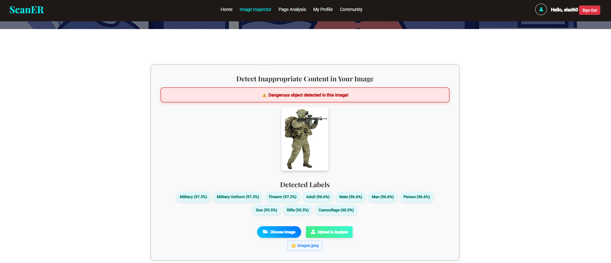
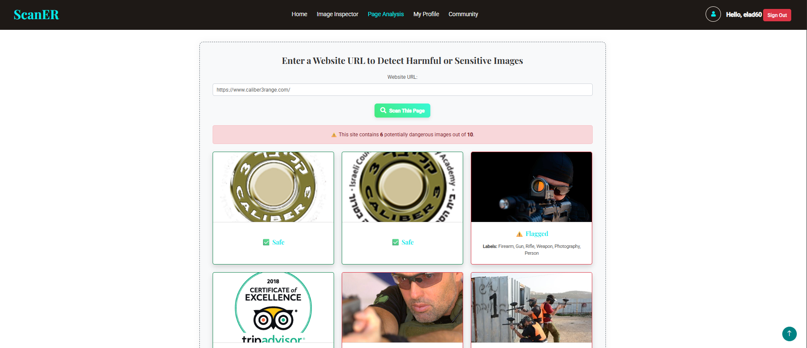
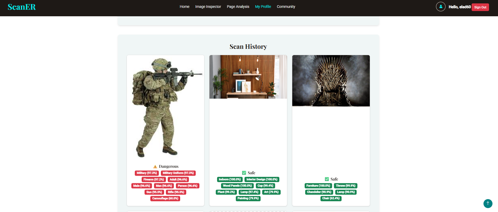

# **ScanER** - AI-Powered Image Moderation Platform


[🔗 Try It Live](https://website-scaner.s3.us-east-1.amazonaws.com/index.html)
---



## Overview

ScanER is a full-stack web application that leverages artificial intelligence to detect inappropriate or harmful content in images. Designed for developers, platform owners, and content managers, ScanER provides fast, accurate, and privacy-focused moderation to keep platforms safe and compliant.

---

## Features

- **AI-Based Image Moderation:** Detects nudity, violence, hate symbols, and more using advanced AI models.
- **Image Inspector:** Upload and analyze images for unsafe content in real time.
- **Webpage Scanner:** Scan any public webpage for images and analyze them for harmful content.
- **User Profiles:** View your scan history and moderation results.
- **Community (Admin Feature):** Explore scans from other users
- **Authentication:** Secure sign-in with AWS Cognito.
- **Modern UI:** Responsive, user-friendly interface built with Bootstrap and jQuery.

---

## 🛠️ Technologies & Architecture

ScanER is built using a modern, fully serverless AWS stack, combining AI, cloud infrastructure, and a responsive frontend.

### 🔹 Frontend
- **HTML, CSS (Bootstrap), JavaScript (jQuery)** – A responsive, user-friendly UI for image moderation, profile viewing, and page scanning.

### 🔹 Authentication
- **Amazon Cognito** – Handles secure sign-up, login, and token-based API authentication.

### 🔹 Backend (Serverless)
- **AWS Lambda (Python)** – Executes moderation, scanning, and user profile logic.
- **Amazon Rekognition** – Detects unsafe or harmful content in images.
- **Amazon API Gateway** – Routes secure REST API calls to backend services.
- **Amazon S3** – Stores uploaded images securely.
- **Amazon DynamoDB** – Saves scan metadata, labels, and user scan history.
- **Amazon SNS** – Sends alerts for dangerous content detection (e.g. weapons).

### 🔹 Infrastructure
- **AWS CloudFormation** – Automates deployment of all resources as code for fast setup and replication.

### 🔹 High-Level Flow

```
User ──> Web App ──> API Gateway ──> Lambda Functions ──> S3 / DynamoDB / Cognito
```

#### AWS Architecture Diagram



#### UML Sequence Diagram



---

## Usage

### 1. Image Inspector

- Go to the Image Inspector page
- Click the 'Choose Image' button and select an image file from your computer.
- Click 'Upload & Analyze'.
- The system will upload your image, analyze it using Amazon Rekognition, and display the results, including detected labels and whether the image is safe or contains harmful content.



### 2. Page Analysis

- Navigate to the 'Page Analysis' section
- Enter the URL of any public webpage you want to scan.
- Click 'Start Web Scan'.
- The system will fetch images from the provided URL, analyze each one for unsafe content, and show a summary of flagged images and details for each image.



### 3. Profile

- Go to the 'My Profile' page
- View your scan history, including all images you have uploaded and their moderation results.
- Each entry shows the image, detected labels, and whether it was flagged as dangerous or safe.



> **Note:** You must be signed in to use the Image Inspector and Profile features. Page Analysis can be used without signing in, but results will not be saved to your profile.

---

## Lambda Functions

- **ScanURL** – Scrapes a given webpage for image URLs (from ``, CSS, and metadata), downloads and filters out irrelevant images (e.g. small or blank), then analyzes each valid image using Amazon Rekognition. Returns detected labels, flags dangerous content, and includes base64 previews.

- **DetectImage** – Triggered by new image uploads to S3. Analyzes the image using Amazon Rekognition, saves detected labels to DynamoDB, and sends an SNS alert if dangerous content (e.g. gun, knife) is found.

- **GetImageLabels** – Retrieves the detected labels for a specific image from DynamoDB, typically used to display results to the user.

- **GetUserScans** – Returns a list of all scanned images associated with a specific user, including metadata.

- **GetProfilesUploadCount** – Aggregates and returns how many images each user has uploaded, useful for admin analytics and insights.

- **ScanPageImages** – Given a webpage URL, extracts and scans all images on the page using Rekognition, similar to `ScanURL` but focused on bulk analysis.

- **UploadPresignedUrl** – Generates a secure, time-limited S3 upload URL that allows users to upload images directly from the frontend without exposing AWS credentials.

---

## Setup & Deployment

### 1. AWS CloudShell Setup

- Upload `template.yaml` and all Lambda `.py` files to CloudShell.
- Zip each Lambda function as shown below:

```bash
mkdir lambdas && cd lambdas
zip detectimage.zip detect_image.py
zip uploadpresignedurl.zip upload_presigned_url.py
zip getimagelabels.zip get_image_labels.py
zip getuserscans.zip get_user_scans.py
zip getprofilesuploadcount.zip get_profiles_upload_count.py
zip scanurl.zip scan_url.py
zip scanpageimages.zip scan_page_images.py
```

### 2. Deploy CloudFormation Stack

```bash
aws cloudformation deploy \
  --template-file template.yaml \
  --stack-name ScanERstack \
  --capabilities CAPABILITY_NAMED_IAM
```

### 3. Upload Lambda Code

Update each Lambda function with your zipped code:

```bash
aws lambda update-function-code --function-name DetectImage-ScanERstack --zip-file fileb://lambdas/detectimage.zip
# ...repeat for each function
```

### 4. Cognito User Setup

```bash
aws cognito-idp sign-up --client-id <CLIENT_ID> --username test@example.com --password <PASSWORD>
aws cognito-idp admin-confirm-sign-up --user-pool-id <USER_POOL_ID> --username test@example.com
```

### 5. API Testing

- Use your Cognito ID token to call the API:

```bash
curl -X GET 'https://<API_ID>.execute-api.us-east-1.amazonaws.com/prod/image?imageName=test_image.png' \
  -H 'Authorization: <ID_TOKEN>'
```
